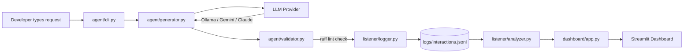
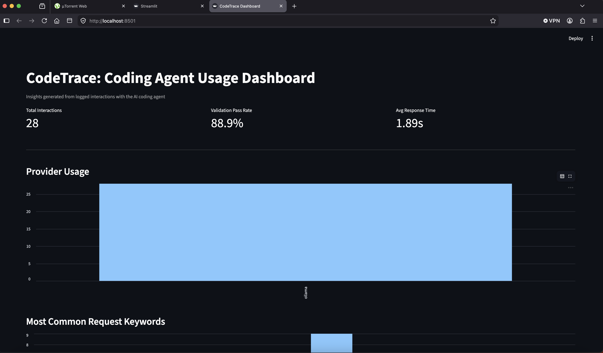
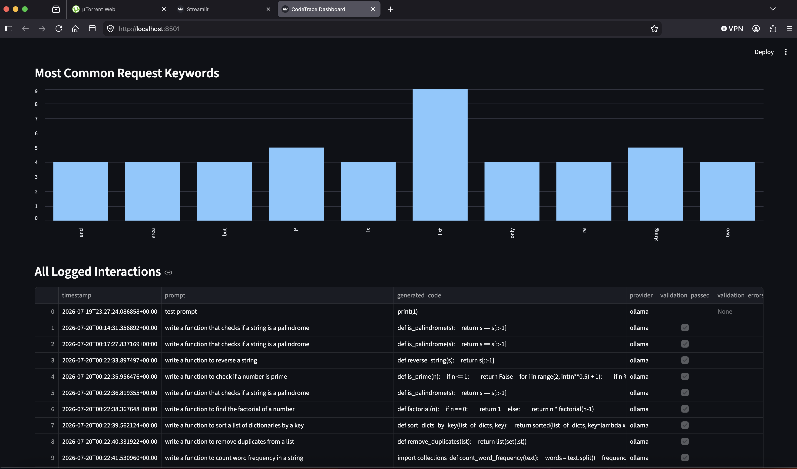

# CodeTrace

An AI coding assistant with a built-in usage-analytics layer — it generates and validates code on request, then logs and analyzes how it's actually used over time.

The project has two halves that can be evaluated independently:
- **The Agent** (code generation + validation) — closest to an "AI coding agent" use case
- **The Listener** (interaction logging + analysis) — closest to a "developer/system interaction listener" use case

## Why

Most AI coding tools generate code but give no visibility into how they're actually being used, where they fail, or what patterns emerge over time. CodeTrace pairs a lightweight code-generation agent with an analytics layer that captures every interaction and surfaces insights from it — e.g. which requests fail validation most often, what developers ask for most, and how response time trends over usage.

## Architecture



The system is **provider-agnostic**: a single `call_llm()` abstraction (`providers/`) routes requests to Ollama (local, free), Gemini, or Claude depending on configuration — allowing development and testing without API costs, while remaining compatible with Anthropic's Claude for production use.

## Features

**Agent**
- Generates code from natural-language requests via a configurable LLM provider
- Validates generated code automatically using `ruff`, checking style (`E`), correctness (`F`), common bug patterns (`B`, via flake8-bugbear), and complexity (`C90`)
- Every generation is validated before being returned to the user

**Listener**
- Logs every interaction (prompt, generated code, provider, validation result, response time) as structured JSONL
- Analyzes logs to surface:
  - Validation pass rate
  - Average response time
  - Most common request keywords/patterns
  - Provider usage breakdown
- Visualized via an interactive Streamlit dashboard

## Example Output




From a batch of **28** logged interactions:
- **88.9%** validation pass rate
- Average response time: **1.89** (local Ollama model, `qwen2.5-coder:7b`)
- Most frequent request themes: string/list manipulation, conditional checks

**A note on validation strictness:** the validator's `ruff` rule set was deliberately expanded partway through development after an initial test batch showed a misleadingly high 100% pass rate. The default rule set only checked basic style and correctness (`E`, `F`); it wasn't catching subtler issues like bare `except` clauses or mutable default arguments. After adding the `B` (bugbear) and `C90` (complexity) rule sets, the validator correctly began catching real problems, including:
- `E722` — bare `except:` clauses that silently swallow errors
- `B006` — mutable default arguments (a classic Python footgun)
- `F821` — references to undefined variables

This was a useful finding in itself: a validation pipeline is only as strict as the rules it's configured to check, and it's worth auditing what a "passing" result actually guarantees.

## Setup

```bash
git clone https://github.com/praveen-vattikala/codetrace.git
cd codetrace
python3 -m venv venv
source venv/bin/activate
python3 -m pip install -r requirements.txt
```

Install [Ollama](https://ollama.com) and pull a coding model:
```bash
brew install ollama
brew services start ollama
ollama pull qwen2.5-coder:7b
```

Copy `.env.example` to `.env` and add any API keys you plan to use:
```bash
cp .env.example .env
```

## Usage

Generate and validate code:
```bash
python3 -m agent.cli "write a function to check if a number is prime"
```

Run the analyzer:
```bash
python3 -m listener.analyzer
```

Launch the dashboard:
```bash
streamlit run dashboard/app.py
```

## Tech Stack
Python · Anthropic Claude API (Claude-compatible via provider abstraction) · Ollama (local LLM) · Google Gemini API · ruff · Streamlit · pandas

## Possible Next Steps
- Self-correction loop: feed validation errors back to the LLM for automatic fixes
- RAG-based retrieval of company-specific style guides before generation
- Security scanning (e.g. `bandit`) as an additional validation stage
- NLP-based keyword extraction instead of basic word-frequency counting

## Relevance

This project was built while exploring two related problem spaces:
1. **AI coding agents** that generate code and validate it against standards
2. **Listener systems** that capture and analyze developer/system interactions to surface actionable insights

CodeTrace combines both into a single, small, end-to-end system.